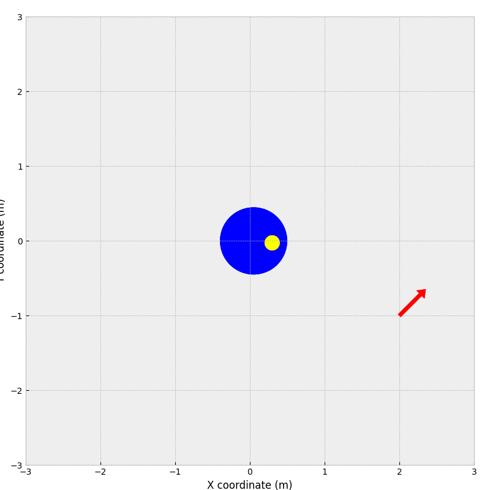
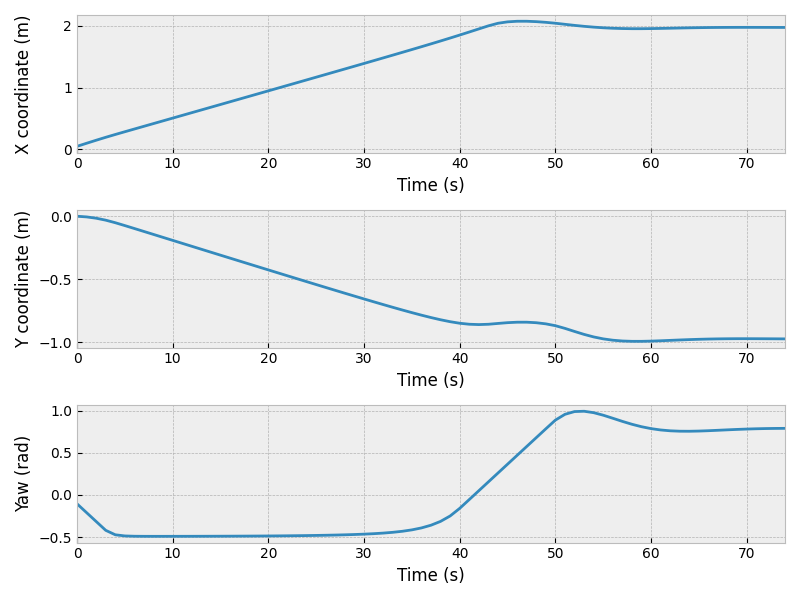
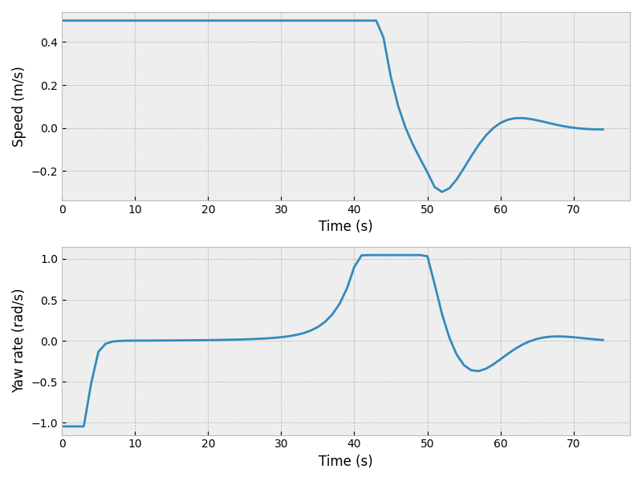

# Overview

This repository holds a collection of examples of model predictive control using the CasADi C++ and Python APIs.

# Examples

## Differential drive robot

This example shows planning with a differential drive robot. The OCP is solved using single shooting.

Codes are available here:

* [Single shooting, differential drive robot (Python)](src/mpc_ss_differential.py)







# Getting started

Clone the repository to a folder of your choice:

```shell
git clone https://github.com/taskbjorn/mpc-playground ~/mpc-playground
```

Then, follow the instructions for the API of your choice.

## Using the Python API examples

To use the CasADi Python API, you will need a working installation of Python 3 with package manager Pip. CasADi has a [package](https://pypi.org/project/casadi/) on PyPI including all required dependencies.

You may install the package using the provided `requirements.txt` file:

```shell
pip install -r requirements.txt
```

You may then run any example by issuing from the root of the repository:

```shell
python src/{example-filename}.py
```
