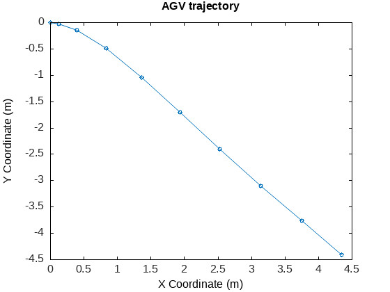
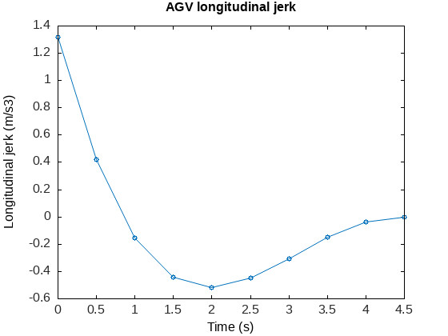
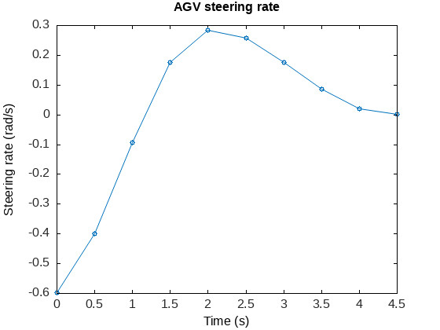

# Overview

This repository holds a collection of examples of model predictive control using the CasADi C++ and Python APIs.

# Examples

## Differential drive robot

This example shows planning with a differential drive robot. The OCP is solved using single shooting.

Codes are available here:

* [Single shooting, differential drive robot (Python)](src/mpc_ss_differential.py)


## Ackermann-steered robot

This example shows an Ackermann-steered robot using a 3 DOF vehicle model and a linear tire. The OCP is solved using multiple shooting.

Codes are available here:

* [Multiple shooting, Ackermann-steered robot (C++)](src/mpc_ms_ackermann.cpp)







# Getting started

Clone the repository to a folder of your choice:

```shell
git clone https://github.com/taskbjorn/mpc-playground ~/mpc-playground
```

Then, follow the instructions for the API of your choice.

## Using the Python API examples

To use the CasADi Python API, you will need a working installation of Python 3 with package manager Pip. CasADi has a [package](https://pypi.org/project/casadi/) on PyPI including all required dependencies.

You may install the package using the provided `requirements.txt` file:

```shell
pip install -r requirements.txt
```

You may then run any example by issuing from the root of the repository:

```shell
python src/{example-filename}.py
```

## Using the C++ API examples

To use the CasADi C++ API, you may be required to build CasADi from sources. Detailed and up-to-date instructions are available [here](https://github.com/casadi/casadi/wiki/SourceBuild), below we provide minimal steps to get a working installation under Ubuntu 22.04 with IPOPT and HSL linear solvers.

### Installing dependencies

Install IPOPT using APT:

```shell
sudo apt install -y coinor-libipopt-dev
```

#### Building CasADi from sources

Clone the CasADi repository in a new location of your choice (the home directory for the current user `~/` in these instructions)

```shell
git clone  https://github.com/casadi/casadi.git ~/casadi
mkdir ~/casadi/build
cd ~/casadi/build
cmake -DWITH_IPTOPT=ON ..
sudo make install -j$((`nproc`+1))
```

### (Optional) Building additional HSL linear solvers from sources

Some examples make use of faster sparse linear solvers such as MA27. In order to use these solvers, they must be built from sources.

Clone the [coin-or-tool/ThirdParty-HSL](https://github.com/coin-or-tools/ThirdParty-HSL) in a new location of your choice (the home directory for the current user `~/` in these instructions):

```shell
git clone https://github.com/coin-or-tools/ThirdParty-HSL ~/ThirdParty-HSL
```

Obtain a personal or academic license for the HSL solvers at the [this](https://www.hsl.rl.ac.uk/ipopt/) link. Unpack the source code archive and move the contents under the ThirdParty-HSL repository folder:

```shell
tar -xvzf coinhsl-x-y-z.tar.gz --directory ~/ThirdParty-HSL
```

Build the ThirdParty-HSL library:

```shell
cd ~/ThirdParty
./configure
sudo make install -j$((`nproc`+1))
```

CasADi looks for the HSL solvers under a legacy name. You may be required to create a symbolic link for the HSL library:

```shell
cd /usr/lib/local
ln -S libcoinhsl.so libhsl.so
```

### (Optional) Building the Matplot++ library from sources

To generate plots at the end of the execution of the C++ examples, the [Matplot++](https://alandefreitas.github.io/matplotplusplus/) library is required. Below are instructions to build the Matplot++ library from sources on Ubuntu 22.04.

Install the required dependencies:

```shell
sudo apt install -y cmake-curses-gui libfftw3-dev
```

Clone the [alandefreitas/matplotplusplus](https://github.com/alandefreitas/matplotplusplus) in a folder of your choice (the home directory for the current user `~/` in these instructions):

```shell
git clone https://github.com/alandefreitas/matplotplusplus ~/matplotplusplus
```

Create a build folder and configure the build using CMake:

```shell
mkdir -p ~/matplotplusplus/build/
cd ~/matplotplusplus/build/
ccmake ../
```

Press `C` to configure your project. After configuring the project:

* Set `CMAKE_BUILD_TYPE` to `Release`
* Set `BUILD_EXAMPLES` to `OFF`

Run the build and install processes:

```shell
sudo make install -j$((`nproc`+1))
```